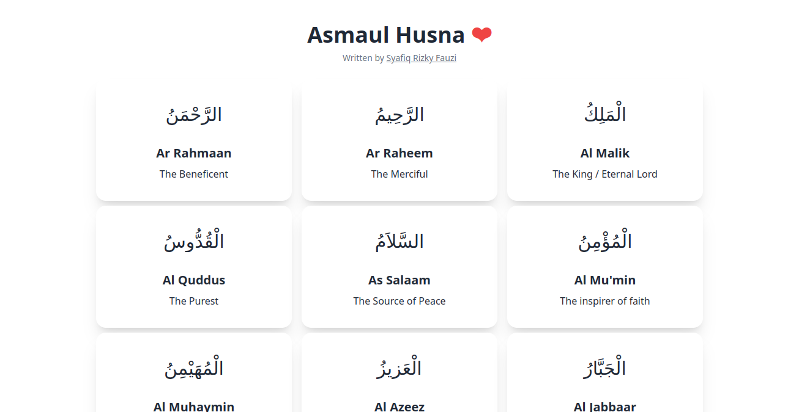

# Asmaul Husna



## Introduction
Asmaul Husna is a collection of 99 names of Allah. The names are arranged in alphabetical order. Each name is accompanied by its meaning and a short description. The names are also accompanied by their transliteration in English and Arabic.

## Tech Stack
- Next Js
- Tailwind CSS
- Daisy UI
- Public API from [aladhan.com](https://aladhan.com/prayer-times-api)

## Installation
1. Clone the repository
2. Install the dependencies
```bash
npm install
or
yarn
```
3. Run the development server
```bash
npm run dev
or
yarn dev
```